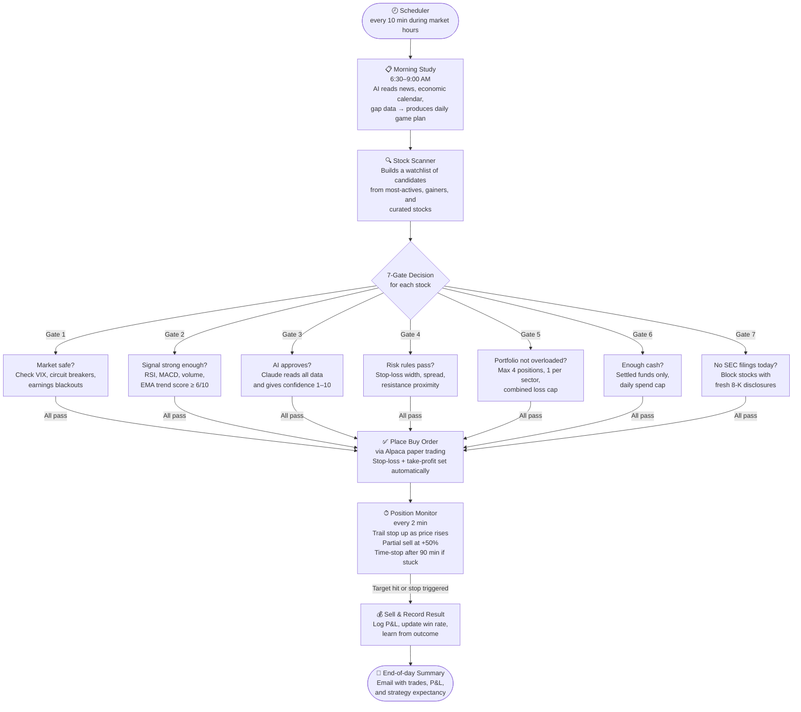

# System Architecture

```mermaid
flowchart TD
    A([🕗 Scheduler\nevery 10 min during market hours]) --> B

    B[📋 Morning Study\n6:30–9:00 AM\nAI reads news, economic calendar,\ngap data → produces daily game plan]

    B --> C

    C[🔍 Stock Scanner\nBuilds a watchlist of candidates\nfrom most-actives, gainers, and\ncurated stocks]

    C --> D

    D{7-Gate Decision\nfor each stock}

    D -->|Gate 1| E[Market safe?\nCheck VIX, circuit breakers,\nearnings blackouts]
    D -->|Gate 2| F[Signal strong enough?\nRSI, MACD, volume,\nEMA trend score ≥ 6/10]
    D -->|Gate 3| G[AI approves?\nClaude reads all data\nand gives confidence 1–10]
    D -->|Gate 4| H[Risk rules pass?\nStop-loss width, spread,\nresistance proximity]
    D -->|Gate 5| I[Portfolio not overloaded?\nMax 4 positions, 1 per sector,\ncombined loss cap]
    D -->|Gate 6| J[Enough cash?\nSettled funds only,\ndaily spend cap]
    D -->|Gate 7| K[No SEC filings today?\nBlock stocks with\nfresh 8-K disclosures]

    E & F & G & H & I & J & K -->|All pass| L

    L[✅ Place Buy Order\nvia Alpaca paper trading\nStop-loss + take-profit set automatically]

    L --> M

    M[⏱ Position Monitor\nevery 2 min\nTrail stop up as price rises\nPartial sell at +50%\nTime-stop after 90 min if stuck]

    M -->|Target hit or stop triggered| N[💰 Sell & Record Result\nLog P&L, update win rate,\nlearn from outcome]

    N --> O([📧 End-of-day Summary\nEmail with trades, P&L,\nand strategy expectancy])
```
