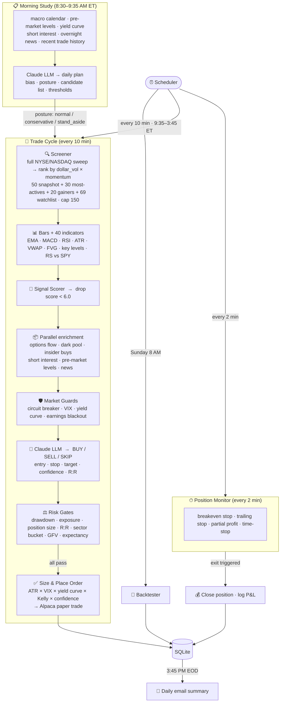

# System Architecture

```mermaid
flowchart TD
    SCHED(["⏰ Scheduler"])
    SCHED -->|"every 10 min · 9:35–3:45 ET"| CYCLE
    SCHED -->|"every 2 min"| POSMGMT
    SCHED -->|"Sunday 8 AM"| BACKTEST["🔬 Backtester"]

    subgraph MORNING ["📋 Morning Study  (8:30–9:35 AM ET)"]
        MS_IN["macro calendar · pre-market levels · yield curve\nshort interest · overnight news · recent trade history"]
        ANALYST["Claude LLM → daily plan\nbias · posture · candidate list · thresholds"]
        MS_IN --> ANALYST
    end

    ANALYST -->|"posture: normal / conservative / stand_aside"| CYCLE

    subgraph CYCLE ["🔄 Trade Cycle  (every 10 min)"]
        SCREEN["🔍 Screener\nfull NYSE/NASDAQ sweep → rank by dollar_vol × momentum\n50 snapshot + 30 most-actives + 20 gainers + 69 watchlist · cap 150"]
        SCREEN --> SCAN["📊 Bars + 40 indicators\nEMA · MACD · RSI · ATR · VWAP · FVG · key levels · RS vs SPY"]
        SCAN --> SCORER["🎯 Signal Scorer  →  drop score < 6.0"]
        SCORER --> ENRICH["📦 Parallel enrichment\noptions flow · dark pool · insider buys\nshort interest · pre-market levels · news"]
        ENRICH --> GUARD["🛡️ Market Guards\ncircuit breaker · VIX · yield curve · earnings blackout"]
        GUARD --> AGENT["🤖 Claude LLM  →  BUY / SELL / SKIP\nentry · stop · target · confidence · R:R"]
        AGENT --> RISK["⚖️ Risk Gates\ndrawdown · exposure · position size · R:R · sector bucket · GFV · expectancy"]
        RISK -->|"all pass"| EXEC["✅ Size & Place Order\nATR × VIX × yield curve × Kelly × confidence\n→ Alpaca paper trade"]
    end

    EXEC --> DB[("SQLite")]

    subgraph POSMGMT ["⏱ Position Monitor  (every 2 min)"]
        PM["breakeven stop · trailing stop · partial profit · time-stop"]
    end
    POSMGMT -->|"exit triggered"| CLOSE["💰 Close position · log P&L"]
    CLOSE --> DB

    DB -->|"3:45 PM EOD"| EOD["📧 Daily email summary"]
    BACKTEST --> DB
```
