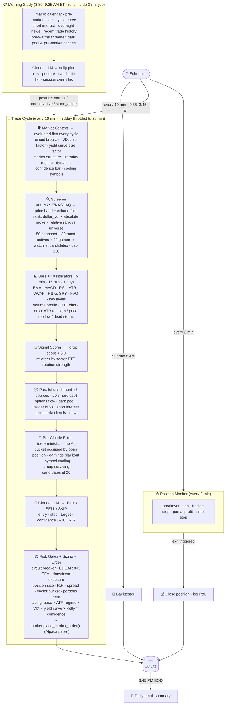

# System Architecture

```mermaid
flowchart TD
    SCHED(["⏰ Scheduler"])
    SCHED -->|"every 10 min · 9:35–3:45 ET"| CYCLE
    SCHED -->|"every 2 min"| POSMGMT
    SCHED -->|"Sunday 8 AM"| BACKTEST["🔬 Backtester"]

    subgraph MORNING ["📋 Morning Study  (8:30–9:35 AM ET · runs inside 2-min job)"]
        MS_IN["macro calendar · pre-market levels · yield curve\nshort interest · overnight news · recent trade history\npre-warms screener, dark pool & pre-market caches"]
        ANALYST["Claude LLM → daily plan\nbias · posture · candidate list · session overrides"]
        MS_IN --> ANALYST
    end

    ANALYST -->|"posture: normal / conservative / stand_aside"| CYCLE

    subgraph CYCLE ["🔄 Trade Cycle  (every 10 min · midday throttled to 20 min)"]
        GUARD["🛡️ Market Context  ← evaluated first every cycle\ncircuit breaker · VIX size factor · yield curve size factor\nmarket structure · intraday regime · dynamic confidence bar · cooling symbols"]
        GUARD --> SCREEN["🔍 Screener\nALL NYSE/NASDAQ → price band + volume filter\nrank: dollar_vol × absolute move × relative rank vs universe\n50 snapshot + 30 most-actives + 20 gainers + watchlist candidates · cap 150"]
        SCREEN --> SCAN["📊 Bars + 40 indicators  (5 min · 15 min · 1 day)\nEMA · MACD · RSI · ATR · VWAP · RS vs SPY · FVG · key levels\nvolume profile · HTF bias · drop: ATR too high / price too low / dead stocks"]
        SCAN --> SCORER["🎯 Signal Scorer  →  drop score < 6.0\nre-order by sector ETF rotation strength"]
        SCORER --> ENRICH["📦 Parallel enrichment  (6 sources · 20 s hard cap)\noptions flow · dark pool · insider buys · short interest · pre-market levels · news"]
        ENRICH --> PREFILTER["🔎 Pre-Claude Filter  (deterministic — no AI)\nbucket occupied by open position · earnings blackout · symbol cooling\n→ cap surviving candidates at 20"]
        PREFILTER --> AGENT["🤖 Claude LLM  →  BUY / SELL / SKIP\nentry · stop · target · confidence 1–10 · R:R"]
        AGENT --> EXEC["⚖️ Risk Gates + Sizing + Order\ncircuit breaker · EDGAR 8-K · GFV · drawdown · exposure\nposition size · R:R · spread · sector bucket · portfolio heat\nsizing: base × ATR regime × VIX × yield curve × Kelly × confidence\n→ broker.place_market_order()  (Alpaca paper)"]
    end

    EXEC --> DB[("SQLite")]

    subgraph POSMGMT ["⏱ Position Monitor  (every 2 min)"]
        PM["breakeven stop · trailing stop · partial profit · time-stop"]
    end
    POSMGMT -->|"exit triggered"| CLOSE["💰 Close position · log P&L"]
    CLOSE --> DB

    DB -->|"3:45 PM EOD"| EOD["📧 Daily email summary"]
    BACKTEST --> DB
```
